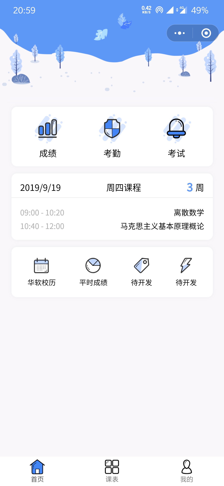
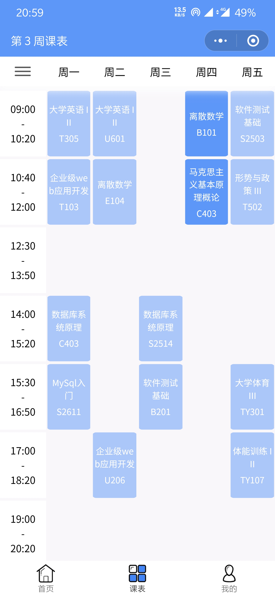
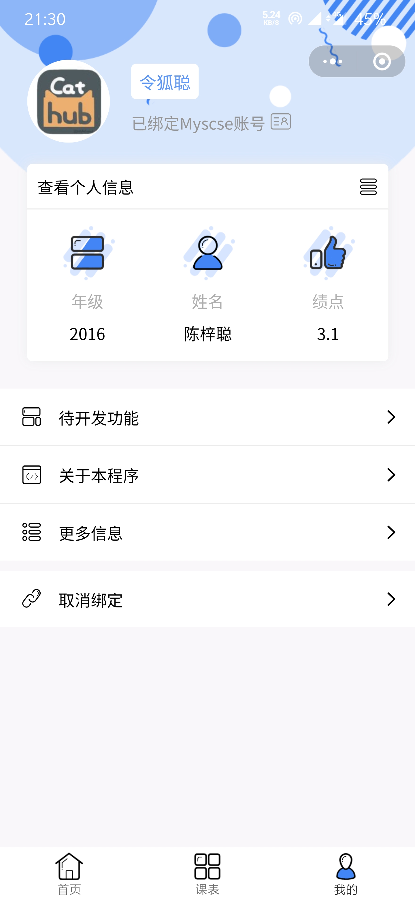
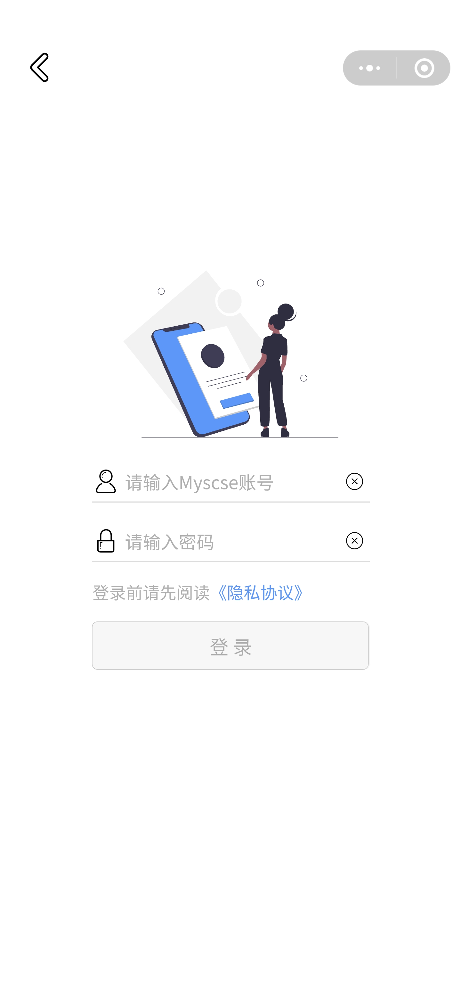

<div align="center">
  
  <h1>意想课表</h1>
  <p>高校教务系统信息查询小程序</p>
</div>

## 界面展示

<div align="center">




</div>

## 介绍

意想课表是一个教务系统信息查询小程序，用于帮助学生们查课表、查成绩、查考勤。

这是我在大学期间开发的第一款小程序，是它让我真正体会到构建一款实用程序的乐趣，感谢所有曾经使用它并提出改善建议都用户！

如果你也想为你的学校开发一个校园助手小程序，我会很乐意提供协助。

## 项目运行

``` bash
# 安装依赖
npm install

# 开发时构建
npm run dev

# 打包构建
npm run build

# 指定平台的开发时构建(微信、百度、头条、支付宝)
npm run dev:wx
npm run dev:swan
npm run dev:tt
npm run dev:my

# 指定平台的打包构建
npm run build:wx
npm run build:swan
npm run build:tt
npm run build:my

# 生成 bundle 分析报告
npm run build --report
```
